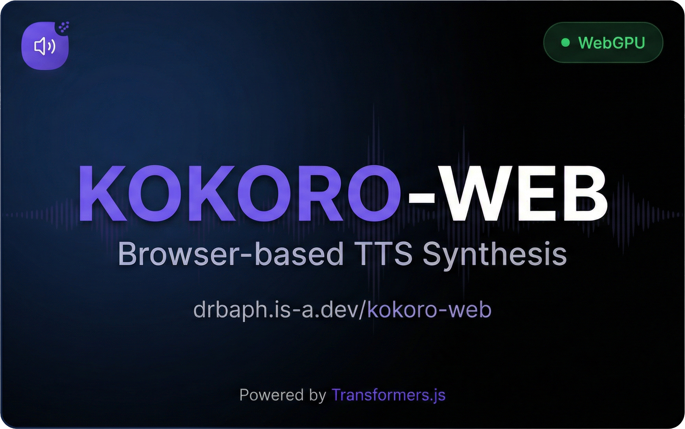

# Kokoro TTS Web



**[Live Demo](https://drbaph.is-a.dev/kokoro-web)**

[](https://huggingface.co/onnx-community/Kokoro-82M-ONNX)
[](https://huggingface.co/docs/transformers.js)
[](LICENSE)

## About

I made this for a couple friends who don't have technical expertise but wanted to create some great sounding TTS - completely free, running directly on their machines in the browser.

No server, no API keys, no installation. Just open the page and start generating speech.

## Features

- **Single TTS** - Generate speech from text with 28 voice options
- **Conversation Mode** - Create multi-speaker conversations with customizable pauses
- **WebGPU & CPU Support** - Automatically uses WebGPU when available, falls back to CPU
- **Smart Model Selection** - Auto-selects `q8` for WebGPU or `q4f16` for CPU based on your hardware
- **Persistent History** - Generated audio is cached in IndexedDB
- **Dark/Light Theme** - Respects your system preference

## Tech Stack

- [Transformers.js](https://huggingface.co/docs/transformers.js) - Run ML models in the browser
- [Kokoro-82M-ONNX](https://huggingface.co/onnx-community/Kokoro-82M-ONNX) - High-quality TTS model
- React + TypeScript + Vite + Tailwind CSS

## Development

```bash
npm install
npm run dev
```

## License

[Apache 2.0](LICENSE)
